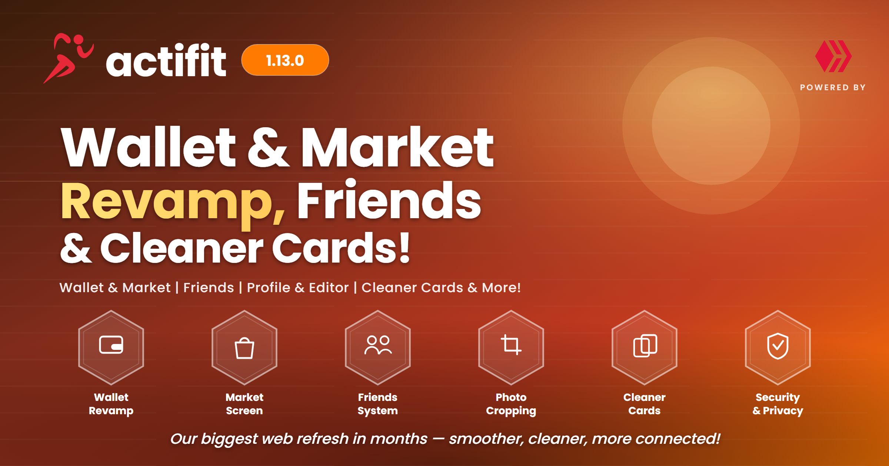

# Actifit Web v1.13.0: Wallet & Market Revamp, Friends, Cleaner Cards & More!

Hey Actifitters! 💪 It's been a busy few months since our last web update, and **Actifit Web v1.13.0** brings all of it together in one big drop! From a **complete Wallet & Market makeover**, to a revamped **Friends** experience, cleaner post & activity cards, richer editing, and another solid round of **security, privacy and performance** work — there's a lot to love here. Let's dive in! 👇

<!-- BEFORE POSTING TO HIVE: upload announcements/actifit-v1.13.0-banner.png to usermedia.actifit.io and replace the line above with  -->

---

## 💼 Wallet & Market: A Full UX/UI Revamp!

Two of the most-used screens on Actifit got a ground-up redesign:

* **🎨 Revamped Wallet Screen:** A cleaner, friendlier, more intuitive layout that puts your balances and actions front and center.
* **🧭 Unified Action Bar + Token Search:** All your wallet actions now live in one tidy bar with a smart "More" overflow menu, and you can **search your tokens instantly**. Resource Credits and pending values were moved up where you actually look for them.
* **🛒 Revamped Market Screen:** A brand-new **collapsible sidebar** with grouped tokens, improved price sorting, product-group search, and smoother mobile behavior — no more horizontal overflow or awkward scrolling on phones.
* **🔐 Smoother Secure Actions:** The funds-password wizard now opens **right in-page** from the Move-AFIT and tip forms, and every authenticated action benefits from **silent Keychain token refresh + retry**, so your session doesn't drop mid-transaction.
* **📊 Accurate HP History:** Fixed the VESTS → Hive Power conversion in your wallet history for correct numbers across the board.

---

## 👥 Friends & Social: More Connected

* **🤝 Suggested Friends:** Reworked rendering, loading, and styling so discovering fellow Actifitters is smoother than ever.
* **👀 View Anyone's Friends:** You can now browse another user's friends list, not just your own.
* **🔗 Cleaner Friend URLs:** Friends pages now use a proper username-based path.
* **✨ Hover Effects:** Social and share icons across the app got subtle, polished hover states.

---

## 🖼️ Profile & Editor Upgrades

* **✂️ Profile Image Cropping:** Upload and **crop your profile picture** right in the browser, with improved export quality and graceful handling of crop/URL errors.
* **📏 Edit Body Measurements:** You can now edit your body measurements directly, with hardened transaction handling behind the scenes.
* **📝 Preview Description Field:** The post editor now lets you set a dedicated **description** (saved to `json_metadata.description`) — better link previews when your posts are shared, and better SEO. Fully translated across all 14 languages.
* **🔁 Logout & Switch User:** New **Logout** and **Switch User** buttons on the profile page make jumping between accounts effortless.
* **🖼️ Sharper Avatars:** Fixed avatar distortion during page load for a crisper first impression.

---

## 📰 Posts, Activity Cards & Content

* **🎯 Aligned Blog & Activity Cards:** Blog and activity cards now share a **consistent look** — matching titles, activity-count formatting, the X (Twitter) icon, "Read more" behavior, and post link structure.
* **❤️ Voted State Restored:** In the card view, the upvote icon correctly shows **red when you've already voted** on a post.
* **🖱️ Click-to-Open Everywhere:** Clicking a card's **body text** now opens the post modal just like clicking its image.
* **🎬 Unified Action Strips:** The post action strip is back in the **header (top + bottom)** and aligned with the new comments format, with corrected icon colors (white by default, red when voted).
* **🔢 Activity Details Back:** The post screen once again shows the **activity count and activity type** where they belong.
* **➖ Declined Payouts:** Posts with declined payout now display the pending value with a clear **strike-through**.
* **⏭️ Smarter Explore Navigation:** In the Explore modal, Previous/Next now navigates **per-community** posts (and no longer crashes while paging through).
* **📺 3Speak Playback Fix:** 3Speak videos now embed in the correct player URL form.

---

## 🌍 Localization (i18n)

* **🈶 25 New Translation Keys:** Added across **all 14 supported languages**, closing gaps in the UI.
* **🔗 Locale-Aware Links:** "New Blog" / "New Video" navbar links now respect your chosen language, and **category post URLs preserve your locale** on redirect.
* **🏷️ Translated Profile & Measurement Labels:** Fully localized across the board.

---

## 🛡️ Security & Privacy

* **🧹 Stored XSS Closed:** Patched a stored-XSS vector in the `$cleanBody` media-restore path.
* **🔑 Auth-Proxy Hardening:** Continued migrating sensitive actions (tip, Move-AFIT, and additional endpoint groups) behind **JWT-authenticated, server-side proxy calls** — keeping secrets off the client.
* **📜 Privacy Policy — Data Retention & Deletion:** Added clear **Data Retention** and **Data Deletion** sections so you know exactly how your data is handled.
* **📦 Dependency Security Updates:** Roughly **15 security-focused dependency bumps** (dompurify, body-parser, nanoid, qs, shell-quote, immutable, and more).
* **✅ Login Reliability:** Fixed the reCAPTCHA loading so posting-key login works reliably.

---

## ⚡ Performance & Stability

* **🚀 Lighter Initial Load:** Removed/lazy-loaded eager third-party assets — including deferring the SimpleMDE editor — for a faster first paint.
* **🙅 Logged-Out Fixes:** The blog screen and video publishing no longer error out for **logged-out visitors**.
* **💬 Messaging Fixes:** Repaired the message bar and message-sending errors.
* **🍪 Cookie Banner:** Fixed the cookie-consent banner overlapping the proposal modal.
* **🔎 SEO Tune-Up:** Addressed a batch of technical SEO issues flagged in our audit.
* **🧭 Navbar Cleanup:** Removed the Consultants entry from the navbar.

...plus a long tail of smaller bug fixes, accessibility improvements, and dark-mode polish throughout. 🐛✨

---

We're always working to make Actifit faster, safer, and more enjoyable to use. This release is a big step in that direction — thank you for moving with us every day! 🙏

Keep moving, keep earning, and as always — thank you for being part of the Actifit journey!

Happy Actifitting!
The Actifit Team

---

**Support Our Work!**

Do you love the Actifit updates and the dedication we put into making your fitness journey more rewarding? Then show us some love! Your support means the world to us and helps us keep building awesome features and improving the platform.

#### Support our witness @actifit on Hive, vote for us or set us as proxy on [actifit profile](https://actifit.io/actifit), or via [peakd](https://peakd.com/witnesses), [hive blog](https://wallet.hive.blog/~witnesses) or [hive-signer](https://hivesigner.com/sign/account-witness-vote?witness=actifit&approve=true).
#### Support our witness @actifit-he on Hive-engine, vote for us on [Tribaldex](https://tribaldex.com/witnesses).

---

**Questions? Suggestions?**

Let us know in the comments below, or reach us on:

[Discord](https://links.actifit.io/discord) | [Twitter](https://www.twitter.com/Actifit_fitness) | [Instagram](https://www.instagram.com/actifit.fitness/) | [Facebook](https://www.facebook.com/Actifit.fitness/)

*Stay Fit. Earn Crypto. Live Better.*

**- The Actifit Team** 🚀
